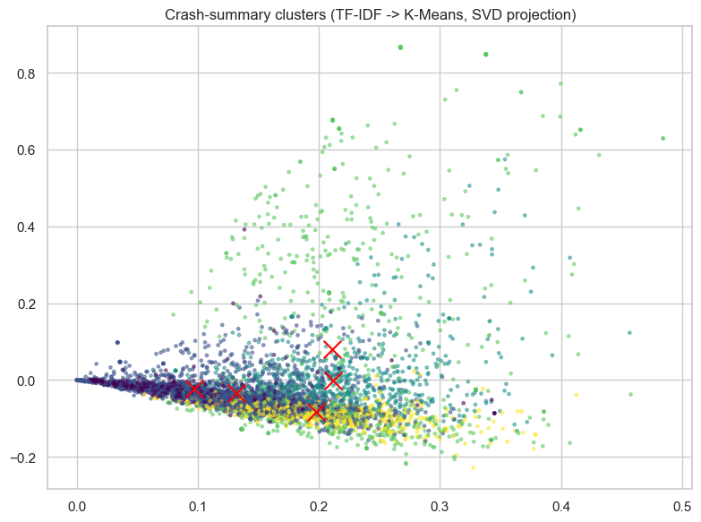

# Plane Crash Analysis

Failure-mode theme discovery across roughly a century of aviation accidents. The notebook
takes about 5,200 free-text crash summaries (1908 to 2009) and asks which recurring failure
modes fall out of them, using unsupervised NLP rather than a trained classifier.

**The project is one executed notebook:
[`plane-crash-analysis.ipynb`](plane-crash-analysis.ipynb).** GitHub renders it with every
output intact, so the results are readable without installing anything.

It began as a coursework project and was reworked into this version: reframed as descriptive
theme discovery rather than "cause prediction", with corrected data handling, a
sparse-friendly 2-D projection, written findings, and a limitations section that says what
the method cannot claim.

## The data

The public *Airplane Crashes and Fatalities Since 1908* dataset:
5,268 rows by 13 columns, first record 1908-09-17, covering civil, commercial and military
accidents worldwide. It is not redistributed here. Download it from
[Kaggle](https://www.kaggle.com/datasets/saurograndi/airplane-crashes-since-1908) and save it
next to the notebook as `Airplane_Crashes_and_Fatalities_Since_1908.csv`, which is the path
section 1 reads. `.gitignore` excludes `*.csv` so a local copy is never committed.

Kaggle also hosts a [newer compilation](https://www.kaggle.com/datasets/cgurkan/airplane-crash-data-since-1908)
of the same record that runs through 2019. Every number in this README comes from the 1908
to 2009 version above, so pointing the notebook at the newer file will not reproduce them:
different row count, different vocabulary, different cluster boundaries. Re-running on it
would be an extension of this analysis, not a correction to it.

Cleaning happens in one cell:

- `Year` is parsed out of inconsistent `Date` strings, and `Country` from the last
  comma-separated field of the free-text `Location`.
- `Aboard`, `Fatalities` and `Ground` are coerced to numeric, so unparseable entries become
  `NaN` instead of silently dropping the row.
- `Survivors = Aboard - Fatalities` is computed only where both are known, and clipped at
  zero, so an inconsistent record cannot produce a negative survivor count.

## Method

TF-IDF over every non-null crash summary (`stop_words="english"`, `max_df=0.5` and
`min_df=5` to trim boilerplate and one-off tokens), then `MiniBatchKMeans` with `k=5` and
`random_state=0`. `TruncatedSVD` projects the sparse matrix to two dimensions for the plot
only; the clustering runs on the full TF-IDF matrix.

## What it found

Five clusters, each labelled by hand from its top TF-IDF terms. The notebook prints twelve
terms per cluster; the first ten of each are reproduced here verbatim:

| Cluster | Top terms | Reading |
| --- | --- | --- |
| 0 | shot, air, land, helicopter, attempting, killed, collision, midair, rebels, missile | Hostile action and midair events |
| 1 | aircraft, taking, flight, plane, shortly, pilot, control, sea, crew, minutes | Loss of control shortly after takeoff, often ending at sea |
| 2 | approach, weather, conditions, poor, mountain, flight, pilot, vfr, adverse, fog | Weather and poor visibility on approach |
| 3 | engine, en, route, plane, takeoff, cargo, mountain, failure, struck, landing | Engine failure en route and on takeoff |
| 4 | runway, short, landing, aircraft, approach, plane, ground, attempting, pilot, land | Runway and landing incidents |



That figure is the notebook's own cell output, byte for byte, not a redrawn version.

The five themes line up with well-known aviation risk categories, which is the main sanity
check that the clustering found something real rather than an artifact of the vectorizer.
Nothing here needed a labelled cause column, because the dataset does not have one.

The descriptive pass in section 3 is a smaller result but a clean one: aggregated by decade,
fatalities as a share of people aboard fall steadily from 0.83 in the 1940s to 0.66 in the
1990s, while the raw accident count peaks in the 1970s at 837. The 2000s row breaks the
trend at 0.69, but the data stops in June 2009, so that decade is not comparable.

## Nearest-theme assignment

Section 5 assigns a short phrase to its closest cluster centroid. It is a similarity lookup,
not a prediction, and the notebook is explicit about that:

```
'engine failure shortly after takeoff' -> theme 3
'struck mountain in poor weather'      -> theme 2
'disappeared en route over the ocean'  -> theme 3
```

The first two land where you would expect. The third is sorted into the engine and en-route
cluster largely on the strength of "en route", which is a fair illustration of what
nearest-centroid matching does and does not understand.

## Limitations

- `k=5` was chosen heuristically, not validated. An elbow or silhouette sweep would justify it.
- Summaries are post-hoc, human-written text, so they carry reporting bias: what got recorded
  and how it was phrased both vary by era and by who wrote it.
- The result is descriptive, not causal. Theme assignment is not failure prediction.
- Early records are sparse and inconsistent, with `Aboard` and `Time` often missing.
- `Country` is the last comma-separated field of a free-text location, so US records land
  under state names. "alaska" and "california" both appear in the top country counts.

Next steps, in the order they would pay off: an elbow or silhouette sweep to justify `k`,
a topic model (NMF or LDA) for softer themes that let a summary belong to more than one, and
tracking how the theme mix shifts by decade.

## Running it

```bash
pip install -r requirements.txt
jupyter lab plane-crash-analysis.ipynb
```

The stored outputs were executed on Python 3.9. `requirements.txt` gives minimum versions
rather than the exact ones; the only hard floor is scikit-learn 1.2, which is where
`n_init="auto"` was added.
